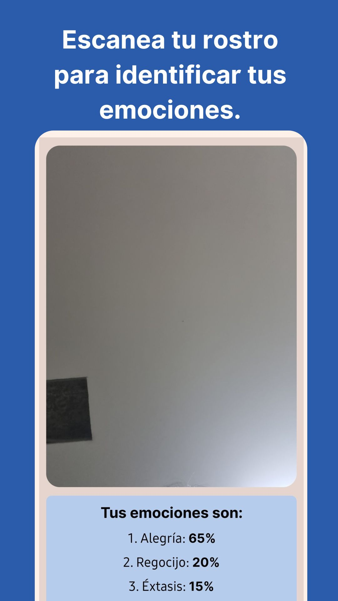
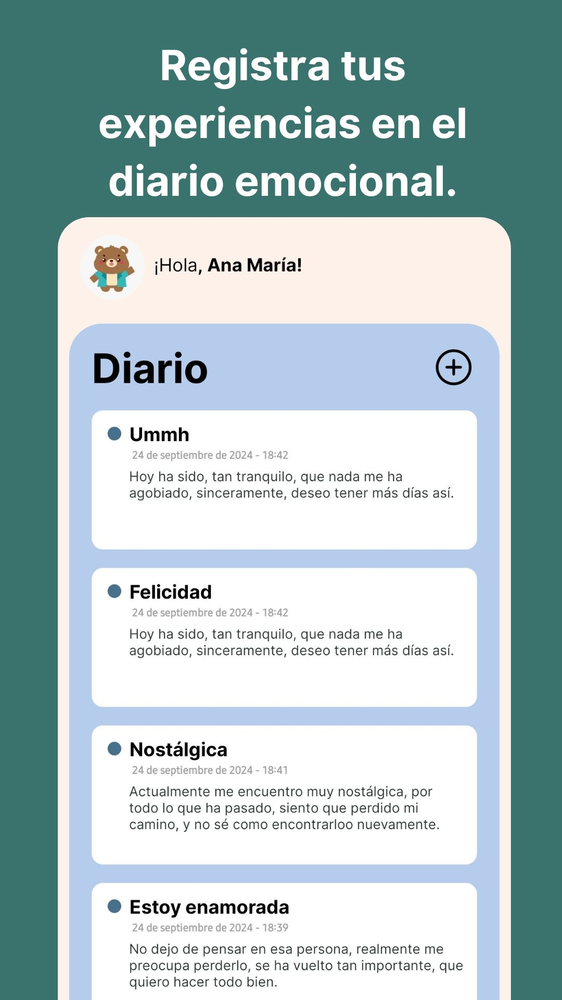
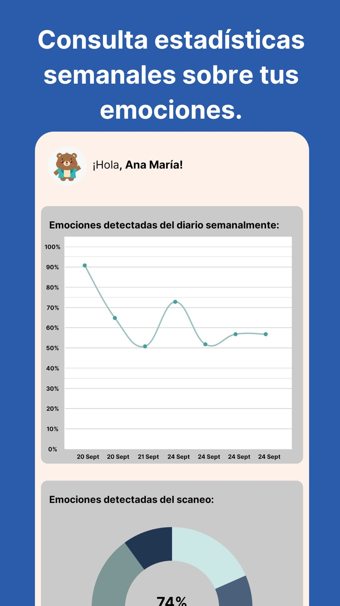
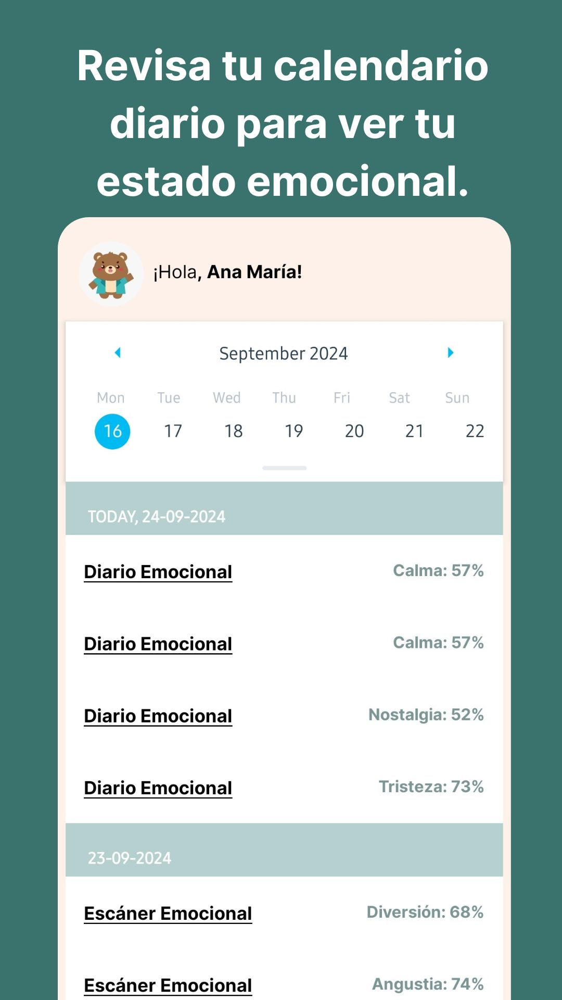
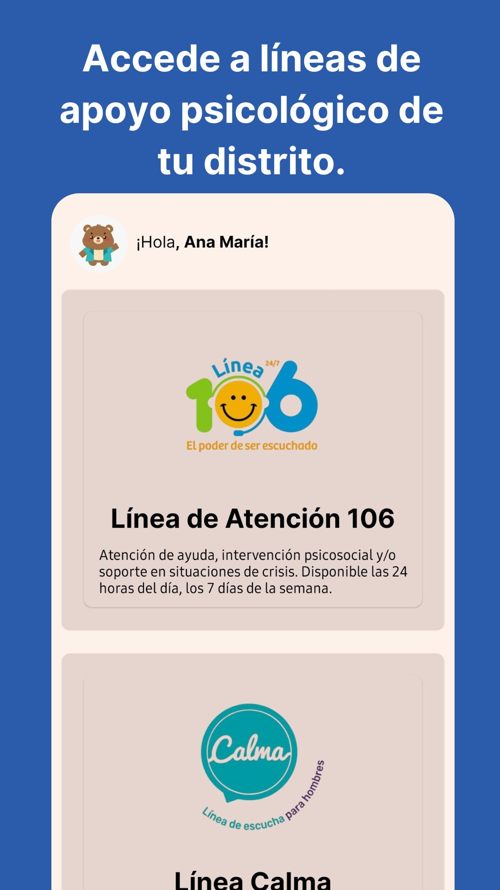

<h2 align="center">PsicoAxioma 🧸</h2>
Es una aplicación de seguimiento emocional post-terapia potenciado por _HUME AI_. 🧸

###

 

###

## **Descripción**
**PsicoAxioma** es una aplicación móvil desarrollada con _React Native_ que integra una robusta infraestructura backend construida en _Node.js_.
Su principal objetivo es proporcionar una herramienta de apoyo psicológico, aprovechando la vanguardia de la inteligencia artificial a través de la plataforma _HUMEAI_.

###

 

###

## **PlayStore**
Puedes encontrar la aplicación de PsicoAxioma en la PlayStore

###

 

###

## **Funcionalidades**

 

 
 
 
 

